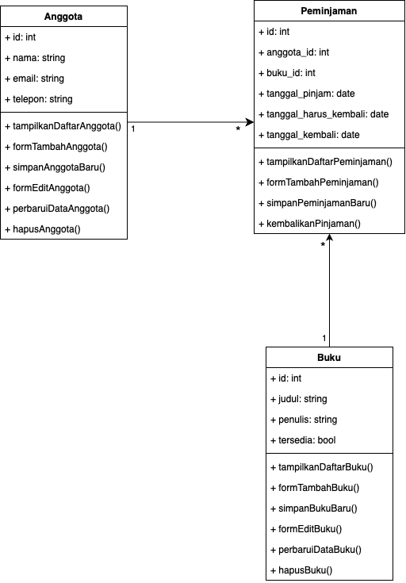

<p align="center"><a href="https://laravel.com" target="_blank"></a></p>

<p align="center">
<a href="https://github.com/laravel/framework/actions"></a>
<a href="https://packagist.org/packages/laravel/framework"></a>
<a href="https://packagist.org/packages/laravel/framework"></a>
<a href="https://packagist.org/packages/laravel/framework"></a>
</p>

## About This Project

This project is built using the Laravel framework and focuses on creating a robust and scalable web application. It follows the Model-View-Controller (MVC) architecture, ensuring clear separation of concerns and maintainable code. It includes features such as:

- Modular architecture for scalability and maintainability.
- Comprehensive testing setup for quality assurance.
- Detailed documentation for easy onboarding and usage.

## Use Case Diagram

The use case diagram for this project provides an overview of the system's functionality and interactions between users and the system. This diagram helps visualize the key actions that users can perform.

<p align="center">
  
</p>

## Class Diagram

The class diagram for this project is available in the main folder. You can view the diagram as an image:

<p align="center">
  
</p>

### Unit Testing

To ensure the reliability of the application, extensive unit testing has been implemented. The unit tests verify the correctness of individual components and cover a variety of scenarios.

#### Unit Test Details

- **Test Code Location:** All feature test cases are located in `tests/feature`.
- **Unit Test Results:** After running the tests, results are stored in the file `tests/unittest-result.xml`.
- **Testing Scenarios:** A detailed testing scenario description can be found in `tests/testing-scenario.md`.

### Running Tests

To execute the tests, use the following command:

```bash
php artisan test
```

Alternatively, to generate the test results in XML format for CI/CD integration:

```bash
php artisan test --testdox --log-junit=tests/unittest-result.xml
```

### Understanding Testing Scenarios

The testing scenarios document (`tests/testing-scenario.md`) outlines:
- Each feature being tested.
- Input and expected output for every scenario.
- Special edge cases considered during testing.

This ensures comprehensive coverage and helps identify any edge cases that need attention.

## About Laravel

Laravel is a web application framework with expressive, elegant syntax. It simplifies many common tasks used in web projects, such as:

- [Simple, fast routing engine](https://laravel.com/docs/routing).
- [Powerful dependency injection container](https://laravel.com/docs/container).
- Multiple back-ends for [session](https://laravel.com/docs/session) and [cache](https://laravel.com/docs/cache) storage.
- Expressive, intuitive [database ORM](https://laravel.com/docs/eloquent).
- Database agnostic [schema migrations](https://laravel.com/docs/migrations).
- [Robust background job processing](https://laravel.com/docs/queues).
- [Real-time event broadcasting](https://laravel.com/docs/broadcasting).

Laravel is accessible, powerful, and provides the tools required for large, robust applications.

## Learning Laravel

Laravel has extensive and thorough [documentation](https://laravel.com/docs) and a video tutorial library, making it easy to get started. You can also try the [Laravel Bootcamp](https://bootcamp.laravel.com), where you’ll be guided through building a modern Laravel application from scratch.

## Contributing

Thank you for considering contributing to this project! Please follow the guidelines outlined in the Laravel [contribution guide](https://laravel.com/docs/contributions).

## Security Vulnerabilities

If you discover a security vulnerability within this project, please notify the maintainers promptly. Your assistance in ensuring the security of this project is greatly appreciated.

## License

This project is open-source software licensed under the [MIT license](https://opensource.org/licenses/MIT).

